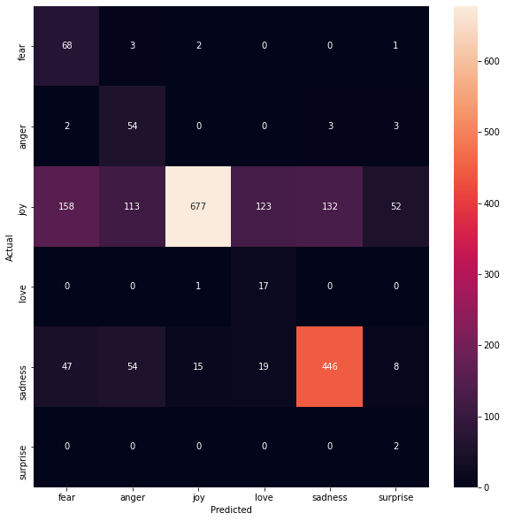
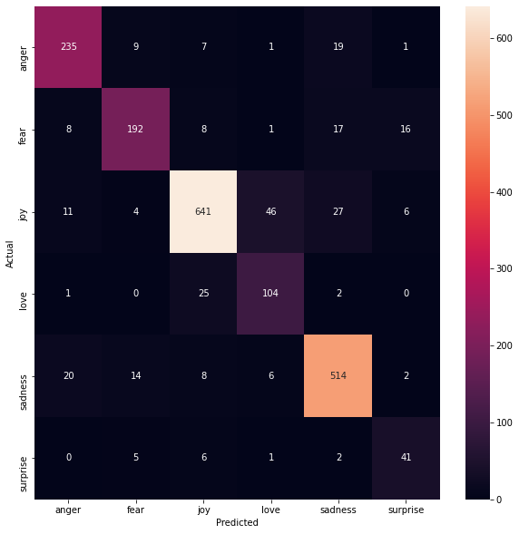
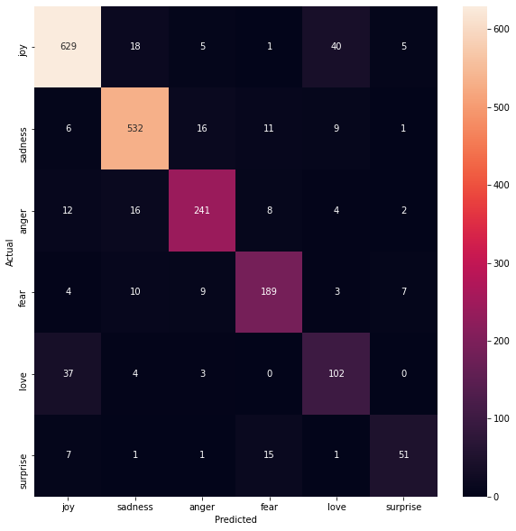

# Emotion Detection By Machine Learning 
surveyed machine learning methods including SVM, Naive Bayes and LSTM to classify the emotion of the text. 

## Majority Vote - Baseline  
 

## Naive-Bayes  
 

## SVM  
 

## LSTM  
 
