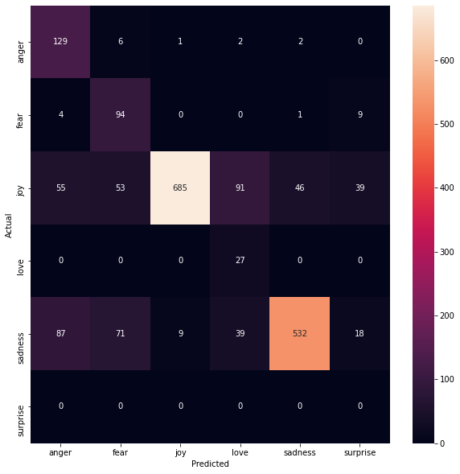

# Emotion Detection By Machine Learning 
surveyed machine learning methods including SVM, Naive Bayes and LSTM to classify the emotion of the text. 

## Majority Vote - Baseline  
 
### accuracy score: 67%  

## Naive-Bayes  
 
### accuracy score: 76%  

## SVM  
 
### accuracy score: 85.3%  

## LSTM  
 
### accuracy score: 87.6%  
