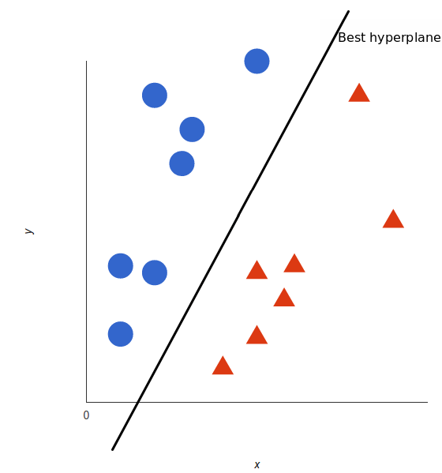

# MachineLearning

- [Emotion Detection](https://github.com/cchun319/MachineLearning/tree/main/Emotion%20Detection) 
surveyed machine learning methods including SVM, Naive Bayes and LSTM to classify the emotion of the text. 
 
- [EM & K-Means](https://github.com/cchun319/MachineLearning/tree/main/EM%20%26%20K-Means) 
 
- [Principle Component Analysis](https://github.com/cchun319/MachineLearning/tree/main/Principle%20Component%20Analysis) 
 
- [Regularized Regression](https://github.com/cchun319/MachineLearning/tree/main/Regularized%20Regression) 
- [Reinforcement Learning & Autoencoder](https://github.com/cchun319/MachineLearning/tree/main/Reinforcement%20Learning%20%26%20Autoencoder) 
 
- [DecisionTree](https://github.com/cchun319/MachineLearning/tree/main/DecisionTree) 
 
- [Support Vector Machine](https://github.com/cchun319/MachineLearning/tree/main/SupportVectorMachine) 
 

## technology
python3.6
